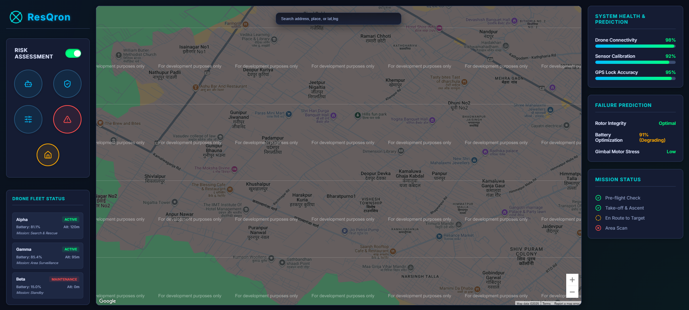

# ResQron – Autonomous Disaster Detection & Response System

<p align="center">
  
  
  
</p>

---

## Vision

**"Disasters don’t wait… so neither should we."**  
ResQron is a next-generation **AI + Drone Powered Disaster Response System** designed to **predict disasters before they strike** and **deliver life-saving aid when every second counts**.

We combine **predictive AI models**, **autonomous drones**, and a **real-time control dashboard** into one integrated system for **smarter, faster, and more reliable disaster management**.

---

##  Core Highlights

ResQron is an **AI-powered disaster response system** that integrates:
- **AI Prediction Models** – Forecast floods, cyclones, earthquakes, and landslides.  
- **Autonomous Drones** – Carry & deliver rescue kits (4–6 kg payload).  
- **Interactive Dashboard** – Real-time monitoring, alerts, and mission control.  
- **Offline AI Inference** – Powered by **TensorFlow Lite Micro** on ESP32 & edge devices.  
- **Modular & Scalable** – Add new sensors, simulations, or response modules easily.  
- **End-to-End Workflow** – From **prediction → response → analysis**.

---

## Problem
When natural disasters strike, **every second counts**.  
Current rescue operations often face:
- Delays in disaster detection.
- Slow supply chain for relief kits.
- Risk to human rescuers entering dangerous zones.

---

## Our Solution
ResQron combines **AI + autonomous drones** to:
1. **Predict disasters** from satellite/sensor data.
2. **Plan missions automatically** using decision engine.
3. **Deploy drones** to deliver supplies within minutes.
4. **Visualize operations** on a central dashboard.

---

##  Demo Preview

<p align="center">
  
</p>

---

##  Project Structure

ResQron/
├── backend/ # Core backend APIs & logic for disaster prediction and drone coordination
|
├── dashboard/ # React-based control & monitoring dashboard for real-time insights
|
├── sim/ # AI simulation models & inference modules (floods, cyclones, etc.)
|
├── docs/ # Documentation, architecture details, and usage guides
|
├── integration_setup.py # Script to configure external APIs and third-party service integrations
|
├── start_services.bat # Quick-start script to launch all services on Windows
|
├── package.json # Frontend (dashboard) dependencies & scripts
|
└── package-lock.json # Dependency lock file for consistent builds

---

##  Quick Start

### 1. Run with Docker (Recommended)
```bash
git clone https://github.com/sharma-0311/ResQron.git
cd ResQron
cp backend/.env.example backend/.env   # configure environment
docker-compose up --build
```

### 2. Backend Setup
```bash
cd backend
python -m venv venv
# Activate venv
source venv/bin/activate      # macOS/Linux
venv\Scripts\activate         # Windows
pip install -r requirements.txt
```

### 3. Frontend Setup
```bash
cd dashboard
npm install
npm run build
```

### 4. Run Services
```bash
# Windows
start_services.bat

# Linux/Mac
# Run backend + frontend manually or create shell script
```

### 5. Access Dashboard
Open: 👉 http://localhost:<PORT>

---

## Use Case
- **Disaster Simulation** – Predict Disasters (River overflows & shelter demands).
- **Evacuation Planning** – Optimize rescue routes during road blockages.
- **Post-Disaster Analysis** – Replay real data & analyze response efficiency.
- **Drone Deployment** – Real-time aid delivery in inaccessible regions.

---

## Documentation
### Explore the docs/folder for:

- System Architecture
- API Endpoints
- Simulation Development Guide
- User Dashboard Manual

---

## Model & Evaluation

Trained models (place inside backend/models/):
- model_flood_v1.pt
- model_cyclone_v1.h5
- model_landslide_v1.tflite

Sample Metrics:
Task|F1 Score|Inference (ms)
| Task | Samples | Metric (F1) | Inference Latency (ms) |
|---------|---------:|------------:|-----------------------:|
| Flood | 5k | 0.86 | 120 |
| Cyclone | 3k | 0.82 | 140 |
| LandSlide | 3k | 0.82 | 140 |

---

## Achievements
 
🏅 **Winners** – HackBhoomi 2025 (Invertis University Internal Hackathon)

✨ **Recognized for AI Innovation in Disaster Response**

---

## Contact
 *Team ResQron*

📧 Email: rgour6350@gmail.com

🌐 GitHub: @sharma-0311

## Final Note

```
ResQron isn’t just a project… it’s a mission.
To make disaster response smarter, faster, and life-saving.

🚁🌊🌪️🔥 "Because in disasters, technology should save lives — not just data. ```
